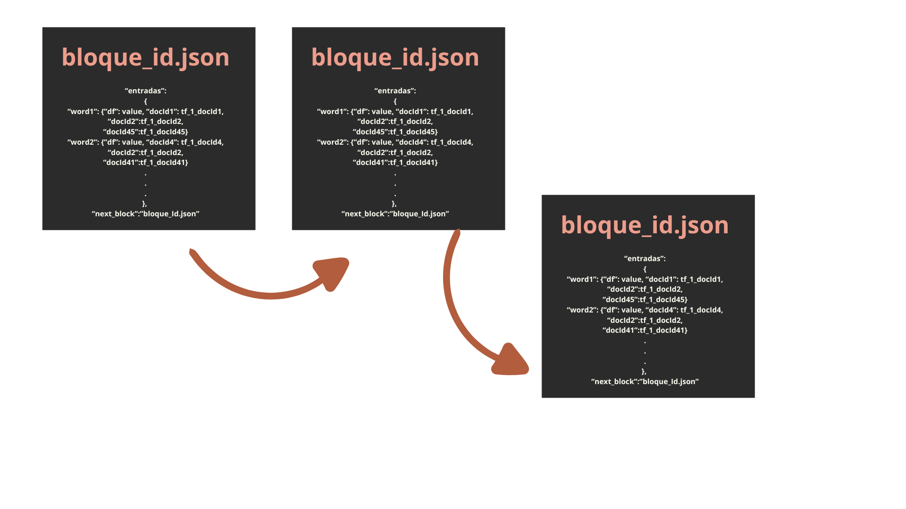
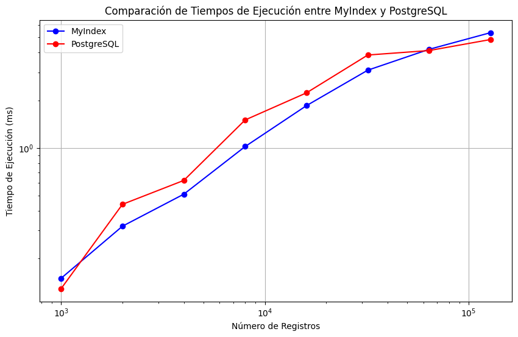

# Proyecto: Full-Text Search
## Introducción

### Objetivo del proyecto
Este proyecto está enfocado en entender y aplicar los algoritmos de búsqueda y recuperación de información basada en el contenido.

### Descripción del dataset
Se trabajó con una base de datos obtenida de Kaggle que contiene información sobre más de 18,000 canciones de Spotify, incluyendo artista, álbum, funciones de audio (por ejemplo, el volumen), letra, idioma de la letra, géneros y subgéneros.

### Importancia de aplicar indexación
La indexación es crucial en sistemas de recuperación de información, especialmente cuando se trabaja con grandes volúmenes de datos textuales. Los índices invertidos y las técnicas de preprocesamiento permiten realizar búsquedas más rápidas y eficientes, mejorando la experiencia del usuario y optimizando el uso de recursos.

## Backend

### Índice Invertido

#### 1. Construcción del índice en memoria secundaria
Para el procesamiento de bloques, creamos la clase `Bloque`, que posee como atributos `limite` (máximo de objetos), `entradas` (elementos) y `next_block` (encargado del encadenamiento de bloques).

```cpp
class Bloque:
    def __init__(self, limite):
        self.limite = limite
        self.entradas = {}
        self.next_block = None

```
- Además la clase posee funciones de agregar_entrada, la cual calcula si la cantidad de entradas del bloque es menor que el límite, en ese caso se agrega al bloque.
```cpp
    def agregar_entrada(self, palabra, docs):
        if len(self.entradas) < self.limite:
            self.entradas[palabra] = docs
            return True
        else:
            return False

    def guardar(self, filename):
        data = {
            'entradas': self.entradas,
            'next_block': self.next_block
        }
        with open(filename, 'w') as file:
            json.dump(data, file)
```
- Por otro lado la función crear bloques:
Crea un objeto de la clase Bloque y se añade a una lista de bloques general. Cada entrada de un bloque representa el término como una key y como values tiene a los documentos y al peso del término. El manejo de archivos de un bloque (ejemplo: bloque_actual) se maneja como tal en formato json y se añaden a la lista mencionada anteriormente
```cpp
def crear_bloques(diccionario_ordenado, limite_bloque):
	bloques = []
    	bloque_actual = Bloque(limite_bloque)
    	bloques.append(bloque_actual)

    	for palabra, docs in diccionario_ordenado.items():
        	if not bloque_actual.agregar_entrada(palabra, docs):
	            nuevo_bloque = Bloque(limite_bloque)
	            #cada bloque posee el termino y los documentos de docs y tf
	            nuevo_bloque.agregar_entrada(palabra, docs)
	            bloque_actual.next_block = f'bloque_{len(bloques)}.json'
	            bloques.append(nuevo_bloque)
	            bloque_actual = nuevo_bloque
```


#### 2. Ejecución óptima de consultas aplicando similitud de coseno: 
En esta parte del código decidimos utilizar una búsqueda binaria para poder buscar de manera efectiva los términos en los bloques de memoria. Dado a que estan ordenados, accedemos a los bloques de memoria a buscar los términos y retornamos en qué bloque se encuentra. A partir de este, extraemos sus documento y su frecuencia del término
    
```cpp
	def binary_search(bloque, term):
		words = sorted(bloque.keys())
	    	low = 0
	    	high = len(words) - 1
	
	    	while low <= high:
	        	mid = (low + high) // 2
	        	mid_word = words[mid]
	
	        	if mid_word == term:
	            		return bloque[mid_word]
	
	        	elif mid_word < term:
				low = mid + 1

	        	else:
	            		high = mid - 1
	    return None
  ```

 #### 3. Procesamiento de la consulta :
 Para procesar la consulta con similitud de coseno seguimos los siguientes pasos:
 1. Obtenemos los términos de cada query
 2. Buscamos los términos en cada bloque por medio de binary search
 3. Computamos el peso (tfidf) del término en el documento
 4. Añadimos el documento dentro de los scores
 5. La función sorted() ordena los documentos en función de su puntuación de similitud, que se almacena en el diccionario doc_scores. La clave de ordenación es item[1], que representa la puntuación de similitud de cada documento. Al establecer reverse=True, se asegura que los documentos con las puntuaciones más altas aparezcan primero.
```cpp
def procesar_consulta(query, k):
    query_terms = recibir_query(query)
    doc_scores = {}

    for term in query_terms:
        for bloque in bloques_cargados:
            result = binary_search(bloque.entradas, term)
            
            if result:
                for doc_id, tf_value in result.items():
                    if doc_id == "df":
                        continue
                    df = result.get("df", 1)
                    tfidf = compute_tfidf(tf_value, df, cant_docs)
                    if doc_id in doc_scores:
                        doc_scores[doc_id] += tfidf
                    else:
                        doc_scores[doc_id] = tfidf

    top_k_documentos = sorted(doc_scores.items(), key=lambda item: item[1], reverse=True)[:k]
    return top_k_documentos
```

### ¿Cómo almacenarmos los bloques en memoria secundaria?
A partir del preprocesamiento obtuvimos un diciconario denso que almacene para cada palabra su df y a parte el tf de la palabra con cada doc en el que esté, el cual ordenamos y dividimos en bloques con indice global para garantizar que una palabra no se repita en más de un bloque y facilitar el acceso a sus datos para el cálculo de la similitud por coseno.


## Conexión mediante API

La API está construida usando Flask, un micro-framework de Python, y se beneficia de Flask-CORS para manejar peticiones de diferentes dominios. Los datos de las canciones están almacenados en un archivo CSV y en una base de datos PostgreSQL.

### 1. Endpoints

#### `/search`

Este es el único endpoint de la API y permite realizar búsquedas de canciones. Las peticiones deben ser de tipo POST y el cuerpo de la petición debe ser un JSON con los siguientes campos:

- `query`: La consulta de búsqueda.
- `topK`: (Opcional) El número de resultados a devolver. Por defecto es 10.
- `indexingMethod`: El método de indexación a utilizar, puede ser `PostgreSQL` o `Índice local`.

#### Ejemplo de petición

```json
{
  "query": "amor",
  "topK": 5,
  "indexingMethod": "PostgreSQL"
}
```

### 2. Estructura del Código

El código se divide en varias partes:

#### Carga y Preprocesamiento de Datos

Se lee el archivo CSV que contiene las letras de las canciones y se eliminan las columnas innecesarias. Luego, se preprocesan las canciones y se crean bloques de datos para el índice local.

```python
import FinalSpimi # Importar el archivo de indexación

# Cargar los bloques y otras variables globales
bloques_cargados, cant_docs = FinalSpimi.cargar_bloques_y_docs()
```

#### Conexión a PostgreSQL

Se define una función para conectarse a la base de datos PostgreSQL utilizando las variables de entorno para los parámetros de conexión.

```python
import psycopg2
from os import environ

def connect_to_postgres():
    return psycopg2.connect(
        host=environ.get('DB_HOST', 'localhost'),
        database=environ.get('DB_NAME', 'proyecto'),
        port=environ.get('DB_PORT', '5432'),
        user=environ.get('DB_USER', 'postgres'),
        password=environ.get('DB_PASSWORD', '210904')
    )
```
##### Configuración de Postgres
En este aparto se mostrará las querys que se utilizaron en Postgres para la creación de la base de datos.

```sql
CREATE EXTENSION IF NOT EXISTS pg_trgm;
CREATE EXTENSION IF NOT EXISTS unaccent;
```
Estas dos líneas instalan extensiones necesarias para la búsqueda de texto. `pg_trgm` permite la búsqueda de similitud de trigramas, mientras que `unaccent` permite remover acentos de los caracteres, facilitando la búsqueda en textos con y sin acentos.

```sql
CREATE TABLE spotify_songs (
    track_id VARCHAR(50) PRIMARY KEY,
    track_name VARCHAR(255),
    track_artist VARCHAR(255),
    lyrics TEXT,
    track_popularity INT,
    track_album_id VARCHAR(50),
    track_album_name VARCHAR(255),
    track_album_release VARCHAR(50),
    playlist_name VARCHAR(255),
    playlist_id VARCHAR(50),
    playlist_genre VARCHAR(50),
    playlist_subgenre VARCHAR(50),
    danceability FLOAT,
    energy FLOAT,
    key INT,
    loudness FLOAT,
    mode BOOL,
    speechiness FLOAT,
    acousticness FLOAT,
    instrumentalness FLOAT,
    liveness FLOAT,
    valence FLOAT,
    tempo FLOAT,
    duration_ms INT,
    language VARCHAR(2)
);
```
Se crea una tabla llamada `spotify_songs` con varias columnas que almacenan información sobre las canciones de Spotify, como el ID de la pista, el nombre de la canción, el artista, las letras, la popularidad, el álbum y características de audio como la capacidad de baile, la energía, etc.

```sql
COPY spotify_songs(track_id,track_name,track_artist,lyrics,track_popularity,track_album_id,track_album_name,track_album_release,playlist_name,playlist_id,playlist_genre,playlist_subgenre,danceability,energy,key,loudness,mode,speechiness,acousticness,instrumentalness,liveness,valence,tempo,duration_ms,language)
FROM 'D:spotify_songs.csv'
DELIMITER ','
CSV HEADER;
```
Se cargan los datos en la tabla `spotify_songs` desde un archivo CSV ubicado en `D:spotify_songs.csv`. El delimitador de los campos es una coma, y el archivo CSV incluye una fila de encabezado.

```sql
CREATE TEXT SEARCH DICTIONARY english_stem (
    TEMPLATE = snowball,
    Language = 'english',
    StopWords = 'english'
);

CREATE TEXT SEARCH DICTIONARY spanish_stem (
    TEMPLATE = snowball,
    Language = 'spanish',
    StopWords = 'spanish'
);
```
Se crean diccionarios de búsqueda de texto para los idiomas inglés y español usando el algoritmo de stemming `snowball`, que reduce las palabras a su raíz común. También se definen listas de palabras vacías para estos idiomas.

```sql
CREATE TEXT SEARCH CONFIGURATION multilingual (COPY = pg_catalog.simple);

ALTER TEXT SEARCH CONFIGURATION multilingual
    ALTER MAPPING FOR asciiword, asciihword, hword_asciipart, word, hword, hword_part
    WITH english_stem, spanish_stem, simple;
```
Se crea una configuración de búsqueda de texto llamada `multilingual` basada en la configuración simple de PostgreSQL. Luego, se ajusta la configuración para usar los diccionarios de stemming en inglés y español, así como la configuración simple por defecto.

```sql
ALTER TABLE spotify_songs ADD COLUMN indexed tsvector;
```
Se añade una nueva columna `indexed` de tipo `tsvector` a la tabla `spotify_songs`. Esta columna se utilizará para almacenar las representaciones de búsqueda de texto de las canciones.

```sql
UPDATE spotify_songs SET indexed = T.indexed 
FROM (SELECT track_id, setweight(to_tsvector('multilingual', track_name), 'A') || setweight(to_tsvector('multilingual', lyrics), 'B') 
      AS indexed 
      FROM spotify_songs) AS T 
WHERE spotify_songs.track_id = T.track_id;
```
Se actualiza la columna `indexed` de la tabla `spotify_songs`. Para cada canción, se crea un `tsvector` combinando el nombre de la canción (con peso A) y las letras (con peso B) usando la configuración de búsqueda `multilingual`. El `tsvector` resultante se almacena en la columna `indexed`.

```sql
CREATE INDEX IF NOT EXISTS abstract_idx_gin ON spotify_songs USING gin (indexed);
```
Se crea un índice GIN en la columna `indexed` de la tabla `spotify_songs`, si no existe ya. Este índice acelera las búsquedas de texto completo en la columna `indexed`.

```sql
-- Ejemplo de consulta textual usando el indice
SELECT track_name, lyrics, duration_ms, ts_rank(indexed, query) rank
FROM spotify_songs, plainto_tsquery('multilingual', 'paparazzi') query
ORDER BY rank DESC LIMIT 10;
```
Finalmente, se muestra un ejemplo de consulta que busca el término 'paparazzi' en la columna `indexed`. La consulta retorna el nombre de la canción, las letras, la duración y el ranking de relevancia (`ts_rank`). Los resultados se ordenan por relevancia en orden descendente y se limitan a los 10 más relevantes, esto va cambiand de acuerdo al usuario.

#### Endpoint de Búsqueda

El endpoint `/search` maneja las peticiones POST y ejecuta la búsqueda según el método de indexación especificado.

```python
def search():
    data = request.get_json()
    query = data.get('query')
    top_k = int(data.get('topK', 10))  # Default de 10 si no se especifica
    indexing_method = data.get('indexingMethod')

    if not query or not indexing_method:
        return jsonify(error="Invalid input"), 400

    if indexing_method == 'PostgreSQL':
        try:
            # Conectar a PostgreSQL y realizar búsqueda con índice GIN
            conn = connect_to_postgres()
            cursor = conn.cursor()

            postgreSQL_select = """
                SELECT track_name, lyrics, duration_ms, ts_rank(indexed, query) AS rank
                FROM spotify_songs, plainto_tsquery('multilingual', %s) query
                ORDER BY rank DESC
                LIMIT %s;
            """

            cursor.execute(postgreSQL_select, (query, top_k))
            results = [{'track_name': row[0], 'lyrics': row[1], 'duration_ms': row[2], 'rank': row[3]} for row in cursor.fetchall()]

            cursor.close()
            conn.close()

            return jsonify(results=results)
        except Exception as e:
            return jsonify(error=str(e)), 500
    elif indexing_method == 'Índice local':
        try:
            # Procesar la consulta utilizando el índice local
            top_k_documentos = FinalSpimi.procesar_consulta(query, top_k, bloques_cargados, cant_docs)
            return jsonify(results=top_k_documentos)
        except Exception as e:
            return jsonify(error=str(e)), 500
    else:
        return jsonify(error="Invalid indexing method"), 400
```

Esta API proporciona una funcionalidad robusta para buscar canciones a partir de sus letras, utilizando tanto una base de datos PostgreSQL con índices GIN como un índice local basado en bloques. La estructura modular y el uso de variables de entorno permiten una configuración flexible y segura.

## Frontend
Para realizar el diseño del frontend se utilizó **React** como framework.
### 1. Diseño de la GUI
Esta aplicación permite buscar canciones rápidamente utilizando diferentes métodos de indexación. Los usuarios pueden ingresar una consulta,
especificar cuántos resultados quieren ver y elegir el método de indexación para optimizar la búsqueda.
1. **Campo de Búsqueda ("Enter your query")**:
   - Aquí puedes escribir la palabra o frase que deseas buscar.

2. **Número de Resultados ("Top K")**:
   - Especifica cuántos resultados quieres que se muestren. Por defecto está en 10.

3. **Método de Indexación ("Indexing Method")**:
   - Un menú desplegable que te permite elegir el método de indexación para la búsqueda. Las opciones pueden incluir PostgreSQL, MongoDB, etc.

4. **Botón de Búsqueda ("Search")**:
   - Haz clic aquí para iniciar la búsqueda con los parámetros especificados.

5. **Tiempo de Consulta ("Query Time")**:
   - Muestra el tiempo que tomó realizar la búsqueda en milisegundos.
6. **Resultados de la Búsqueda**:
   - La lista de resultados que coinciden con la consulta. Cada resultado muestra:
     - El título de la canción.
     - La duración de la canción.
     - Un puntaje de relevancia (si aplica).
### 2. Instrucciones de Uso

1. **Realizar una Búsqueda**:
   - Escribe tu consulta en el campo de búsqueda. Por ejemplo, "hhshshshshs".
   - Especifica el número de resultados que deseas ver en el campo "Top K". Por ejemplo, 10.
   - Selecciona el método de indexación desde el menú desplegable.
   - Haz clic en el botón "Search".

3. **Cambiar el Método de Indexación**:
   - Abre el menú desplegable junto a "Indexing Method".
   - Selecciona el método que deseas utilizar.
   - Realiza la búsqueda nuevamente para ver cómo cambia el tiempo de consulta y los resultados.

#### 3. Screenshots de la GUI
  -  ⁠Esta imagen es antes de escribir alguna consulta.
    	
  -  Ejecutando un consulta "boy" y usando el método de indexación de postgress. Al lado izquierdo nos retorna la posición 1 del top K.
    	
  -  Si deslizamos hacia abajo podemos encontrar las letras de las canciones.
    	

#### 4.  Video de Experimentación
  [Video de experimetacion](https://drive.google.com/drive/folders/1YBS4eYEmEPJ5OJARIYKlu2CUmoAQMwqx)

### 5. Requisitos Previos

Asegúrate de tener Node.js y npm (Node Package Manager) instalados en tu sistema.

### 6. Pasos para Configurar y Ejecutar la Aplicación
 - Abre tu terminal y clona el repositorio de la aplicación.
 - Luego ejecute los siguentes comandos
1. Para activar el frontend
   ```
   cd frontend
   npm install
   npm run dev
   ```
2. Para activar el backend
   ```
   python -m venv venv
   source venv/bin/activate
   pip install -r requirements.txt
   python3 api.py
   ```
   
   
## Experimentación

Se presenta una comparativa en tiempo de ejecución de cada implementación en función del número de registros. Para todos los casos, la cantidad de elementos recuperados en el top k se toma como 10.

| Número de Registros | MyIndex        | PostgreSQL           |
|---------------------|----------------|----------------------|
| N = 1000            |    0.150 ms    |    0.129 ms          |
| N = 2000            |    0.320 ms    |    0.440 ms          |
| N = 4000            |    0.510 ms    |    0.623 ms          |
| N = 8000            |    1.020 ms    |    1.502 ms          |
| N = 16000           |    1.850 ms    |    2.228 ms          |
| N = 32000           |    3.100 ms    |    3.865 ms          |
| N = 64000           |    4.200 ms    |    4.125 ms          |
| N = 128000          |    5.350 ms    |    4.842 ms          |

### Interpretación de Resultados

#### Comparación de Tiempos de Ejecución

Los resultados obtenidos de las comparaciones de tiempo de ejecución entre las implementaciones MyIndex y PostgreSQL muestran diferencias notables en el rendimiento a medida que el número de registros aumenta. A continuación, se detallan las observaciones clave:

- **MyIndex**:
  - Para conjuntos de datos más pequeños (N = 1000 a N = 8000), MyIndex tiene tiempos de ejecución comparables o ligeramente mejores que PostgreSQL.
  - A medida que el tamaño del conjunto de datos aumenta (N = 16000 a N = 128000), el tiempo de ejecución de MyIndex aumenta de manera más pronunciada en comparación con PostgreSQL. Esto sugiere que MyIndex puede no ser tan eficiente en el manejo de grandes volúmenes de datos.

- **PostgreSQL**:
  - PostgreSQL muestra un tiempo de ejecución más consistente y eficiente a medida que aumenta el número de registros. Esto es especialmente evidente en conjuntos de datos grandes (N = 32000 a N = 128000), donde PostgreSQL supera a MyIndex en términos de velocidad.
  - La utilización de índices GIN y GiST en PostgreSQL permite una búsqueda más rápida y eficiente, lo que se refleja en los tiempos de ejecución más bajos para grandes volúmenes de datos.

#### Gráfica de Comparación de Tiempos de Ejecución



##### Interpretación de la Gráfica

- Escalabilidad: PostgreSQL con el índice GIN demuestra una mejor escalabilidad en comparación con MyIndex, especialmente cuando se manejan grandes volúmenes de datos. Esto es crucial para aplicaciones que esperan un crecimiento significativo en la cantidad de datos.
- Eficiencia: Los tiempos de ejecución más bajos de PostgreSQL en grandes conjuntos de datos indican una mayor eficiencia en la recuperación de información. Esto puede deberse a los avanzados mecanismos de indexación y optimización de consultas que PostgreSQL implementa.
- Adecuación del Índice: Aunque MyIndex (SPIMI) puede ser útil y eficiente para conjuntos de datos más pequeños o medianos, PostgreSQL muestra una clara ventaja en entornos de datos grandes, lo que lo hace más adecuado para aplicaciones con necesidades de búsqueda a gran escala.


### Recuperación de textos en PostgresSQL
#### Índices
Explicando cómo funciona el índice invertido para la recuperación de textos, PostgresSQL hace uso de índices **GIN** para acelerar las búsquedas.
##### Generalized Inverted Index (GIN)
Es un tipo de índice que almacena un mapeo inverso de términos a documentos, permitiendo búsquedas eficientes de términos en grandes colecciones de documentos relacionados
#### Funciones de similitud
##### Ts_rank
Este calcula la relevancia de un documento en función de la frecuencia de los términos de búsqueda, basándose en la posición y la cantidad de ocurrencias
##### Ts_rank_cd
Parecido el Ts_rank, este considera adicionalmente la cantidad de términos distintos que cubren el documento

## Índice multidimensional

### Técnicas de indexación y librerías utilizadas

Claro, a continuación te presento una versión unificada y detallada del apartado de técnicas de indexación y librerías utilizadas, incluyendo la información adicional que solicitaste:

---

### Técnicas de Indexación y Librerías Utilizadas

#### KNN-Rtree:
Para esta técnica se usa la librería *rtree*, la cual nos brinda funciones importantes implementadas en nuestro código, entre ellas:

- ```index.Property()```: Nos permite construir el índice con las propiedades de la librería.
- ```index.insert(id_, (*vector, *vector))```: Nos permitió insertar las hojas del R-tree de la forma (identificador, tupla del vector).
- ```index.nearest(coordinates=tuple(query_features), num_results=k)```: Nos permite obtener los "k" vecinos más cercanos (similares a una canción) a partir de una consulta.

**Procedimiento del R-tree**

- **Obtención del MBR de los puntos:** 
    - Al inicio, se deben obtener el conjunto de puntos y calcular el valor del MBR (Minimum Bounding Rectangle) de ellos.
    - Agrupar los puntos acorde a su cercanía entre ellos.
- **Agrupación con nodos internos:** 
    - Una vez se comienzan a agrupar los puntos, hay un límite máximo de cantidad de puntos en los rectángulos. Para ello, se agrupan recursivamente y se expanden en MBRs más grandes (los cuales tendrán punteros que apuntan a sus nodos hijos).

### Complejidad de las Operaciones del R-tree

1. **Construcción del R-tree:**
   - **Complejidad:** O(nlog n)
   - **Explicación:** La construcción del R-tree implica organizar los datos en una estructura jerárquica de nodos, donde cada nodo puede contener múltiples entradas. En promedio, la inserción de cada elemento en el R-tree tiene una complejidad logarítmica debido a la subdivisión del espacio en regiones, y repetir esta operación para (n) elementos da como resultado una complejidad total de O(nlog n).

2. **Inserción de un elemento:**
   - **Complejidad:** O(\log n)
   - **Explicación:** La inserción de un elemento en el R-tree requiere encontrar la hoja adecuada donde se debe insertar el nuevo elemento. Esto implica recorrer el árbol desde la raíz hasta una hoja, lo que típicamente toma tiempo logarítmico respecto al número de elementos ya presentes en el árbol.

3. **Búsqueda de vecinos más cercanos (`knn_query`):**
   - **Complejidad:** O(k log n)
   - **Explicación:** La búsqueda de los (k) vecinos más cercanos implica realizar una búsqueda prioritaria en el árbol, evaluando las distancias y comparándolas para encontrar las (k) más pequeñas. Este proceso tiene una complejidad logarítmica para cada uno de los (k) vecinos buscados.
### Ventajas y Desventajas del R-tree

#### Ventajas del R-tree

- **Eficiencia en Consultas Espaciales:** Los R-trees son muy eficientes para realizar consultas espaciales como búsqueda de vecinos más cercanos y búsqueda por rango.
- **Adaptabilidad a Datos Dinámicos:** Permiten la inserción y eliminación de elementos sin necesidad de una reconstrucción completa del índice.
- **Soporte Multidimensional:** Pueden gestionar datos en múltiples dimensiones, lo que los hace útiles en aplicaciones geoespaciales y de bases de datos espaciales.

#### Desventajas del R-tree

- **Complejidad de Implementación:** La implementación de R-trees puede ser más compleja en comparación con otros índices como los B-trees.
- **Rendimiento Variable:** El rendimiento del R-tree puede degradarse si los datos no están bien distribuidos, resultando en nodos desbalanceados y menos eficientes.

#### KNN-HighD:
Partiendo de que un índice reduce su eficiencia con una alta dimensionalidad en espacios vectoriales (maldición de la dimensionalidad), existen diversas formas de mitigar este problema. Una de ellas es la reducción de la dimensionalidad, mediante técnicas como PCA, SVD, Random Projection, UMAP, entre otros. Para el presente proyecto sin embargo se trabajó con el índice LSH (Locality-Sensitive Hashing) para la implementación de Faiss con KNN, el cual mitiga en otro enfoque este problema.

**Indice LSH**
\
Es una técnica de indexación que permite buscar vecinos aproximados en espacios de alta dimensión de manera eficiente. Principalmente mapea puntos de un espacio de alta dimensión a un espacio de menor dimensión (o a un conjunto de "cubos" hash), siendo que los puntos cerca del espacio original tengan una alta probabilidad caer en el mismo cubo hash.
Dentro de las funciones de hashing que usa para la localización, estos también permiten mapear vectores de alta dimensión a un conjunto más manejable de bits, lo cual reduce la complejidad de búsqueda en el espacio de alta dimensión. 

**FAISS (Facebook AI Similarity Search)**
\
Se encarga de la búsqueda eficiente de similitud y recuperación de información en grandes colecciones de vectores de alta dimensión (en este caso los feature vectors de las canciones).
Además de gestionar el índice LSH, la librería también cumple con:
- Añadir vectores de alta dimensión al índice
- Realizar consultas eficientes para encontrar los vecinos más cercanos a un vector de consulta
- Devolver las distancias y los índices de los vecinos más cercanos.

### Complejidad de las Operaciones del KNN-HighD

1. **Carga de Características desde el CSV:**
   - **Complejidad:** O(n * d)
   - **Explicación:** La carga del archivo por sí solo lleva una complejidad lineal en función del número de filas del csv. A eso se le suma la conversión de filas del DataFrame en una lista de tuplas, multiplicando n por d, la dimensión de los vectores característicos.
2. **Construcción del Índice:**
   - **Complejidad:** O(n * d) + O(n * num_bits)
   - **Explicación:** Convertir la colección de características en un array de Numpy tiene una complejidad de n*d. A eso se le suma la adición de vectores al índice, ya que cada vector se debe hash a num_bits cubos
3. **Consulta K-Vecinos:**
   - **Complejidad:** O(d) + O(k * num_bits) + O(k)
   - **Explicación:** La conversión de vectores en el formato especificado tiene complejidad en función de la dimensión manejada, mientras que la operación de búsqueda en el índice usando cada cubo debe ser el k de recuperación por el número de bits asociado. Por último, obtener los resultados finales y sus distancias requieren de una complejidad de k

**Plus del Front**

Para mostrar nuestro trabajo de la mejor manera y que la plataforma de búsqueda de canciones sea lo más realista, realizamos consultas a la API de Itunes de apple.
Le enviamos el nombre del álbum de una canción y la respuesta de Itunes es en formato .json donde mediante la clave [artworkUrl100] obtenemos la url del poster del álbum de la canción para que esta pueda ser representada en nuestro frontend.

 ```py
def get_itunes_album_cover_url(album_name):
    search_url = f"https://itunes.apple.com/search?term={album_name}&entity=album"
    response = requests.get(search_url)
    data = response.json()

    if data['resultCount'] > 0:
        return data['results'][0]['artworkUrl100']  #se puede ajustar el tamaño (100, 200, 400, etc)
    else:
        return None
 ```
Ejemplo de obtención del url:
`https://itunes.apple.com/search?term={Night%20at%20the%20opera}&entity=album`

Respuesta de Itunes
```json
"artistName":"Queen", "collectionName":"A Night at the Opera (Deluxe Edition)", "collectionCensoredName":"A Night at the Opera (Deluxe Edition)", "artistViewUrl":"https://music.apple.com/us/artist/queen/3296287?uo=4", "collectionViewUrl":"https://music.apple.com/us/album/a-night-at-the-opera-deluxe-edition/1440650816?uo=4", "artworkUrl60":"https://is1-ssl.mzstatic.com/image/thumb/Music125/v4/a7/00/d7/a700d715-a493-19a5-3de9-5753d139419f/14DMGIM05597.rgb.jpg/60x60bb.jpg",

```
Y la url de la clave dada nos lleva al poster:


Así también realizamos la extracción de los audios a shazam:

## Integrantes
|                    **Bihonda Epiquien Rodas**                   |                          **Paola Maguiña**                          |                         **Camila Acosta**                          |                         **Sebastian Tenorio**                         |                       **Sofía Herrera**                       |
|:---------------------------------------------------------------:|:-------------------------------------------------------------------:|:-------------------------------------------------------------------:|:------------------------------------------------------------------:|:-------------------------------------------------------------:|
| <a href="https://github.com/bihoepiro" target="_blank">`github.com/bihoepiro`</a> | <a href="https://github.com/paolamag" target="_blank">`github.com/paolamag`</a> | <a href="https://github.com/arosteguicp" target="_blank">`github.com/arosteguicp`</a> | <a href="https://github.com/Yellow2392" target="_blank">`github.com/Yellow2392`</a> | <a href="https://github.com/sofiyin" target="_blank">`github.com/sofiyin`</a> |

### Project Board

Para ver el progreso del proyecto, visita nuestro [tablero del proyecto](https://github.com/users/bihoepiro/projects/1).


