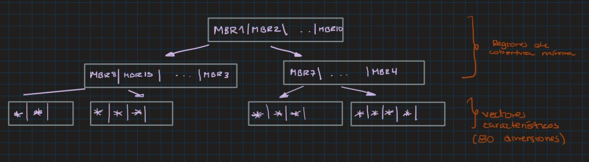
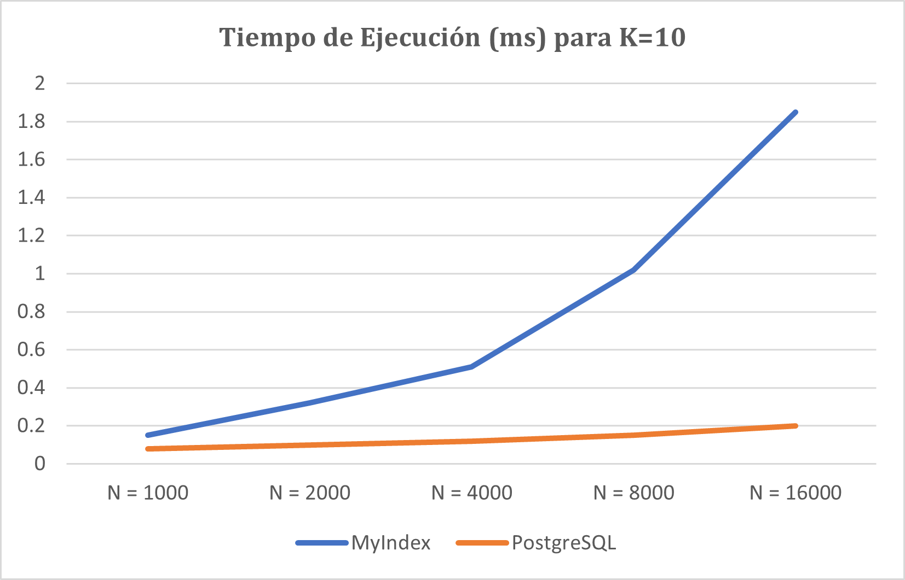
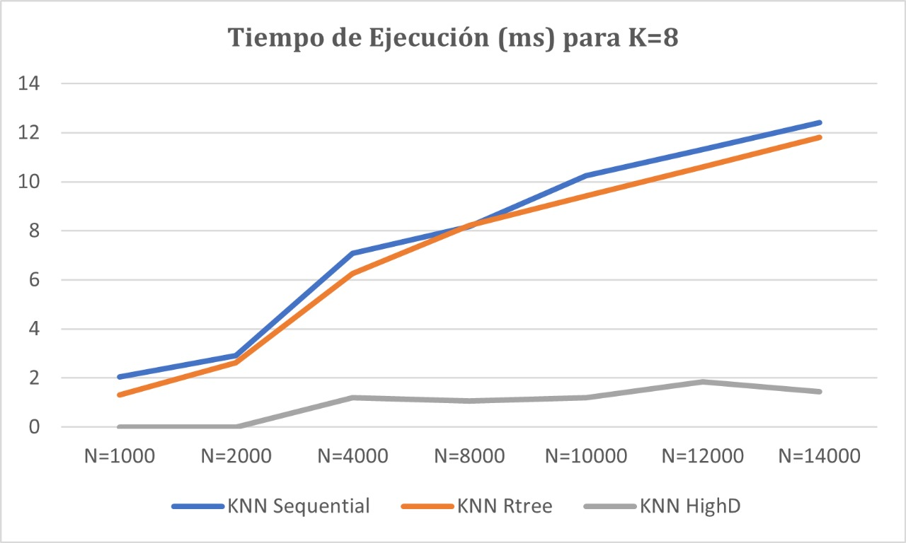

# Proyecto Final
## Introducción

### Objetivo del proyecto
Este proyecto está enfocado en entender y aplicar los algoritmos de búsqueda y recuperación de información basada en el contenido.

### Descripción del dataset
Se trabajó con una base de datos obtenida de Kaggle que contiene información sobre más de 18,000 canciones de Spotify, incluyendo artista, álbum, funciones de audio (por ejemplo, el volumen), letra, idioma de la letra, géneros y subgéneros.

### Importancia de aplicar indexación
La indexación es una técnica fundamental en los sistemas de recuperación de información, especialmente cuando se trabaja con grandes volúmenes de datos. La implementación de índices permite realizar búsquedas más rápidas y eficientes, mejorando la experiencia del usuario y optimizando el uso de recursos. Dos enfoques clave en la indexación son los índices invertidos y los índices multidimensionales, cada uno adecuado para diferentes tipos de datos y aplicaciones.

## Backend

## Índice Invertido

#### 1. **Construcción del índice en memoria secundaria**
Para el procesamiento de bloques, creamos la clase `Bloque`, que posee como atributos `limite` (máximo de objetos), `entradas` (elementos) y `next_block` (encargado del encadenamiento de bloques).

```cpp
class Bloque:
    def __init__(self, limite):
        self.limite = limite
        self.entradas = {}
        self.next_block = None

```
- Además la clase posee funciones de agregar_entrada, la cual calcula si la cantidad de entradas del bloque es menor que el límite, en ese caso se agrega al bloque.
```cpp
    def agregar_entrada(self, palabra, docs):
        if len(self.entradas) < self.limite:
            self.entradas[palabra] = docs
            return True
        else:
            return False

    def guardar(self, filename):
        data = {
            'entradas': self.entradas,
            'next_block': self.next_block
        }
        with open(filename, 'w') as file:
            json.dump(data, file)
```
- Por otro lado la función crear bloques:
Crea un objeto de la clase Bloque y se añade a una lista de bloques general. Cada entrada de un bloque representa el término como una key y como values tiene a los documentos y al peso del término. El manejo de archivos de un bloque (ejemplo: bloque_actual) se maneja como tal en formato json y se añaden a la lista mencionada anteriormente
```cpp
def crear_bloques(diccionario_ordenado, limite_bloque):
	bloques = []
    	bloque_actual = Bloque(limite_bloque)
    	bloques.append(bloque_actual)

    	for palabra, docs in diccionario_ordenado.items():
        	if not bloque_actual.agregar_entrada(palabra, docs):
	            nuevo_bloque = Bloque(limite_bloque)
	            #cada bloque posee el termino y los documentos de docs y tf
	            nuevo_bloque.agregar_entrada(palabra, docs)
	            bloque_actual.next_block = f'bloque_{len(bloques)}.json'
	            bloques.append(nuevo_bloque)
	            bloque_actual = nuevo_bloque
```


#### 2. **Ejecución óptima de consultas aplicando similitud de coseno: **
En esta parte del código decidimos utilizar una búsqueda binaria para poder buscar de manera efectiva los términos en los bloques de memoria. Dado a que estan ordenados, accedemos a los bloques de memoria a buscar los términos y retornamos en qué bloque se encuentra. A partir de este, extraemos sus documento y su frecuencia del término
    
```cpp
	def binary_search(bloque, term):
		words = sorted(bloque.keys())
	    	low = 0
	    	high = len(words) - 1
	
	    	while low <= high:
	        	mid = (low + high) // 2
	        	mid_word = words[mid]
	
	        	if mid_word == term:
	            		return bloque[mid_word]
	
	        	elif mid_word < term:
				low = mid + 1

	        	else:
	            		high = mid - 1
	    return None
  ```

#### 3. **Procesamiento de la consulta :**
 Para procesar la consulta con similitud de coseno seguimos los siguientes pasos:
 1. Obtenemos los términos de cada query
 2. Buscamos los términos en cada bloque por medio de binary search
 3. Computamos el peso (tfidf) del término en el documento
 4. Añadimos el documento dentro de los scores
 5. La función sorted() ordena los documentos en función de su puntuación de similitud, que se almacena en el diccionario doc_scores. La clave de ordenación es item[1], que representa la puntuación de similitud de cada documento. Al establecer reverse=True, se asegura que los documentos con las puntuaciones más altas aparezcan primero.
```cpp
def procesar_consulta(query, k):
    query_terms = recibir_query(query)
    doc_scores = {}

    for term in query_terms:
        for bloque in bloques_cargados:
            result = binary_search(bloque.entradas, term)
            
            if result:
                for doc_id, tf_value in result.items():
                    if doc_id == "df":
                        continue
                    df = result.get("df", 1)
                    tfidf = compute_tfidf(tf_value, df, cant_docs)
                    if doc_id in doc_scores:
                        doc_scores[doc_id] += tfidf
                    else:
                        doc_scores[doc_id] = tfidf

    top_k_documentos = sorted(doc_scores.items(), key=lambda item: item[1], reverse=True)[:k]
    return top_k_documentos
```

### ¿Cómo almacenarmos los bloques en memoria secundaria?
A partir del preprocesamiento obtuvimos un diciconario denso que almacene para cada palabra su df y a parte el tf de la palabra con cada doc en el que esté, el cual ordenamos y dividimos en bloques con indice global para garantizar que una palabra no se repita en más de un bloque y facilitar el acceso a sus datos para el cálculo de la similitud por coseno.


### GIN en PostgresSQL

#### 1. Creación del Índice GIN
El índice GIN en PostgreSQL se utiliza para mejorar significativamente la eficiencia de las búsquedas de texto completo dentro de bases de datos. Al aplicar un índice GIN a una columna tsvector, como en el caso de indexed en la tabla spotify_songs, PostgreSQL crea una estructura invertida que mapea términos de texto a los documentos que los contienen.

```sql
ALTER TABLE spotify_songs ADD COLUMN indexed tsvector;
```
#### 2. Generación de tsvector
Para cada canción, se genera un tsvector combinando el título y las letras con pesos asignados ('A' y 'B') utilizando to_tsvector('multilingual', ...). Este tsvector captura tanto la importancia relativa del título como el contenido de las letras de la canción.

```sql
UPDATE spotify_songs SET indexed = T.indexed 
FROM (SELECT track_id, setweight(to_tsvector('multilingual', track_name), 'A') || setweight(to_tsvector('multilingual', lyrics), 'B') AS indexed 
      FROM spotify_songs) AS T 
WHERE spotify_songs.track_id = T.track_id;
```
Posteriormente, se crea un índice GIN en la columna indexed para acelerar las búsquedas de texto completo. Este índice permite una recuperación eficiente de información incluso en grandes volúmenes de datos textuales.
```sql
CREATE INDEX IF NOT EXISTS abstract_idx_gin ON spotify_songs USING gin (indexed);
```

#### 3. Consulta de Búsqueda de Texto Completo
Para ejecutar una consulta de búsqueda de texto completo, se utiliza plainto_tsquery para convertir términos de búsqueda en un objeto tsquery. Luego, se emplea ts_rank para calcular la relevancia de los resultados basándose en la frecuencia y posición de los términos coincidentes.

```sql
SELECT track_name, lyrics, duration_ms, ts_rank(indexed, query) AS rank
FROM spotify_songs, plainto_tsquery('multilingual', 'paparazzi') query
WHERE query @@ indexed
ORDER BY rank DESC
LIMIT 10;
```

## Índice Multidimensional
### KNN Secuencial

En esta técnica se utiliza un KDTree de sklearn para realizar búsquedas KNN en un conjunto de características cargadas desde un archivo CSV. Este enfoque es más directo y proporciona resultados exactos, pero puede volverse ineficiente en espacios de alta dimensionalidad.

#### 1. **Código de Implementación**

```python
import pandas as pd
from sklearn.neighbors import KDTree

caracteristicas = df_caracteristicas.drop(columns=['track_id']).values
track_ids = df_caracteristicas['track_id'].values

tree = KDTree(caracteristicas)

def buscar_knn(consulta_id, k):
    # Obtener el vector de características de la canción de consulta
    consulta_vector = df_caracteristicas[df_caracteristicas['track_id'] == consulta_id].drop(columns=['track_id']).values
    if consulta_vector.shape[0] == 0:
        raise ValueError(f"Track ID {consulta_id} not found in features_vectors.csv")
    
    distancias, indices = tree.query(consulta_vector, k=k)
    
    # Obtener los resultados de las K canciones más cercanas
    resultados = [(track_ids[i], distancias[0][j]) for j, i in enumerate(indices[0])]
    return resultados
```

#### 2. **Descripción de la Librería**

2.1 `sklearn.neighbors.KDTree`
La librería `sklearn.neighbors.KDTree` pertenece a `scikit-learn`, una biblioteca muy popular en Python para el aprendizaje automático. El `KDTree` es una estructura de datos en forma de árbol que permite realizar búsquedas rápidas de vecinos más cercanos (KNN).

#### 3. Ventajas y Desventajas del KNN-Secuencial

3.1 **Ventajas**:
   - **Rápida Recuperación**: Los árboles KDTree permiten realizar consultas de KNN de manera eficiente, reduciendo el tiempo de búsqueda en comparación con una búsqueda secuencial directa en un espacio de alta dimensión.
     
3.2 **Desventajas**

   - **Limitación en Dimensiones**: Los KDTree funcionan mejor en espacios de dimensiones más bajas (generalmente menos de 20). Y los vectores de nuestro data set es de 80 dimensiones.
   - **Actualizaciones Dinámicas**: No es eficiente para datos que cambian frecuentemente, ya que requeriría la reconstrucción del árbol.

### KNN-Rtree
Para esta técnica se usa la librería *rtree*, la cual nos brinda funciones importantes implementadas en nuestro código, entre ellas:

- ```index.Property()```: Nos permite construir el índice con las propiedades de la librería.
- ```index.insert(id_, (*vector, *vector))```: Nos permitió insertar las hojas del R-tree de la forma (identificador, tupla del vector).
- ```index.nearest(coordinates=tuple(query_features), num_results=k)```: Nos permite obtener los "k" vecinos más cercanos (similares a una canción) a partir de una consulta.



#### 1. **Procedimiento del R-tree**

1.1 **Obtención del MBR de los puntos:** 
- Al in1icio, se deben obtener el conjunto de puntos y calcular el valor del MBR (Minimum Bounding Rectangle) de ellos.
- Agrupar los puntos acorde a su cercanía entre ellos.
1.2 **Agrupación con nodos internos:** 
- Una vez se comienzan a agrupar los puntos, hay un límite máximo de cantidad de puntos en los rectángulos. Para ello, se agrupan recursivamente y se expanden en MBRs más grandes (los cuales tendrán punteros que apuntan a sus nodos hijos).

#### 2. **Complejidad de las Operaciones del R-tree**

2.1 **Construcción del R-tree:**
   - **Complejidad:** O(nlog n)
   - **Explicación:** La construcción del R-tree implica organizar los datos en una estructura jerárquica de nodos, donde cada nodo puede contener múltiples entradas. En promedio, la inserción de cada elemento en el R-tree tiene una complejidad logarítmica debido a la subdivisión del espacio en regiones, y repetir esta operación para (n) elementos da como resultado una complejidad total de O(nlog n).

2.2 **Inserción de un elemento:**
   - **Complejidad:** O(\log n)
   - **Explicación:** La inserción de un elemento en el R-tree requiere encontrar la hoja adecuada donde se debe insertar el nuevo elemento. Esto implica recorrer el árbol desde la raíz hasta una hoja, lo que típicamente toma tiempo logarítmico respecto al número de elementos ya presentes en el árbol.

2.3 **Búsqueda de vecinos más cercanos (`knn_query`):**
   - **Complejidad:** O(k log n)
   - **Explicación:** La búsqueda de los (k) vecinos más cercanos implica realizar una búsqueda prioritaria en el árbol, evaluando las distancias y comparándolas para encontrar las (k) más pequeñas. Este proceso tiene una complejidad logarítmica para cada uno de los (k) vecinos buscados.
#### 3. Ventajas y Desventajas del R-tree

3.1 **Ventajas del R-tree**

- **Eficiencia en Consultas Espaciales:** Los R-trees son muy eficientes para realizar consultas espaciales como búsqueda de vecinos más cercanos y búsqueda por rango.
- **Adaptabilidad a Datos Dinámicos:** Permiten la inserción y eliminación de elementos sin necesidad de una reconstrucción completa del índice.
- **Soporte Multidimensional:** Pueden gestionar datos en múltiples dimensiones, lo que los hace útiles en aplicaciones geoespaciales y de bases de datos espaciales.

3.2 **Desventajas del R-tree**

- **Complejidad de Implementación:** La implementación de R-trees puede ser más compleja en comparación con otros índices como los B-trees.
- **Rendimiento Variable:** El rendimiento del R-tree puede degradarse si los datos no están bien distribuidos, resultando en nodos desbalanceados y menos eficientes.

### KNN-HighD

Partiendo de que un índice reduce su eficiencia con una alta dimensionalidad en espacios vectoriales (maldición de la dimensionalidad), existen diversas formas de mitigar este problema. Una de ellas es la reducción de la dimensionalidad, mediante técnicas como PCA, SVD, Random Projection, UMAP, entre otros. Para el presente proyecto sin embargo se trabajó con el índice LSH (Locality-Sensitive Hashing) para la implementación de Faiss con KNN, el cual mitiga en otro enfoque este problema.

#### **Índice LSH**

Es una técnica de indexación que permite buscar vecinos aproximados en espacios de alta dimensión de manera eficiente. Principalmente mapea puntos de un espacio de alta dimensión a un espacio de menor dimensión (o a un conjunto de "cubos" hash), siendo que los puntos cerca del espacio original tengan una alta probabilidad caer en el mismo cubo hash.
Dentro de las funciones de hashing que usa para la localización, estos también permiten mapear vectores de alta dimensión a un conjunto más manejable de bits, lo cual reduce la complejidad de búsqueda en el espacio de alta dimensión. 
Esta parte del código crea el índice LSH utilizando las características cargadas. Si no hay características cargadas, lanza un error. Convierte los vectores en un array de Numpy y los añade al índice LSH.
```
def build_index(self):
    if not self.collection:
        raise ValueError("No features loaded.")
    d = self.collection[0][1].shape[0]
    self.index = faiss.IndexLSH(d, self.num_bits)
    features = np.asarray([feat for _, feat in self.collection], dtype=np.float32)
    self.index.add(features)
```

 #### **FAISS (Facebook AI Similarity Search)**

Se encarga de la búsqueda eficiente de similitud y recuperación de información en grandes colecciones de vectores de alta dimensión (en este caso los feature vectors de las canciones).
Además de gestionar el índice LSH, la librería también cumple con:
- Añadir vectores de alta dimensión al índice:  `self.index.add(features)` 
- Realizar consultas eficientes para encontrar los vecinos más cercanos a un vector de consulta: `distances, indices = self.index.search(query_features.reshape(1, -1).astype('float32'), k)`  
- Devolver las distancias y los índices de los vecinos más cercanos: `results = [(self.collection[idx][0], distances[0][i]) for i, idx in enumerate(indices[0])]`
- 
#### 1. **Complejidad de las Operaciones del KNN-HighD**

1.1 **Carga de Características desde el CSV:**
   - **Complejidad:** O(n * d)
   - **Explicación:** La carga del archivo por sí solo lleva una complejidad lineal en función del número de filas del csv. A eso se le suma la conversión de filas del DataFrame en una lista de tuplas, multiplicando n por d, la dimensión de los vectores característicos.
1.2 **Construcción del Índice:**
   - **Complejidad:** O(n * d) + O(n * num_bits)
   - **Explicación:** Convertir la colección de características en un array de Numpy tiene una complejidad de n*d. A eso se le suma la adición de vectores al índice, ya que cada vector se debe hash a num_bits cubos
1.3 **Consulta K-Vecinos:**
   - **Complejidad:** O(d) + O(k * num_bits) + O(k)
   - **Explicación:** La conversión de vectores en el formato especificado tiene complejidad en función de la dimensión manejada, mientras que la operación de búsqueda en el índice usando cada cubo debe ser el k de recuperación por el número de bits asociado. Por último, obtener los resultados finales y sus distancias requieren de una complejidad de k.

## Frontend

El frontend consume dos API's, una para Índice Invertido (`api.py`) y otra para Índice Multidimensional (`knnsequential.py`).

Para realizar el diseño del frontend se utilizó **React** como framework.
### 1. Diseño de la GUI
Esta aplicación permite buscar canciones rápidamente utilizando diferentes métodos de indexación. Los usuarios pueden ingresar una consulta,
especificar cuántos resultados quieren ver y elegir el método de indexación para optimizar la búsqueda.
1. **Campo de Búsqueda ("Enter your query")**:
   - Aquí puedes escribir la palabra o frase que deseas buscar.

2. **Número de Resultados ("Top K")**:
   - Especifica cuántos resultados quieres que se muestren. Por defecto está en 10.

3. **Método de Indexación ("Indexing Method")**:
   - Un menú desplegable que te permite elegir el método de indexación para la búsqueda. Las opciones pueden incluir PostgreSQL, MongoDB, etc.

4. **Botón de Búsqueda ("Search")**:
   - Haz clic aquí para iniciar la búsqueda con los parámetros especificados.

5. **Tiempo de Consulta ("Query Time")**:
   - Muestra el tiempo que tomó realizar la búsqueda en milisegundos.
6. **Resultados de la Búsqueda**:
   - La lista de resultados que coinciden con la consulta. Cada resultado muestra:
     - El título de la canción.
     - La duración de la canción.
     - Un puntaje de relevancia (si aplica).
 7. **Método de KNN ("Test Method")**:
    - Un menú desplegable que te permite elegir el método de KNN: Secuencial, RTree y HighD.
       
### 2. Instrucciones de Uso

1. **Realizar una Búsqueda**:
   - Escribir l< consulta en el campo de búsqueda. Por ejemplo, "hhshshshshs".
   - Especificar el número de resultados que se desea ver en el campo "Top K". Por ejemplo, 10.
   - Seleccionar el método de indexación desde el menú desplegable.
   - Hacer clic en el botón "Search".

2. **Cambiar el Método de Indexación**:
   - Abrir el menú desplegable junto a "Indexing Method".
   - Seleccionar el método que deseas utilizar.
   - Realizar la búsqueda nuevamente para ver cómo cambia el tiempo de consulta y los resultados.
  
3. **Cambiar el Método de KNN**:
   - Elegir una de las canciones de las que se mostraron de la primera búsqueda.
   - Seleccionar el método de KNN que se dea utilizar.

### 3. Screenshots de la GUI - P2
  -  ⁠Esta imagen es antes de escribir alguna consulta.
    	
  -  Ejecutando una consulta "boy" y usando el método de indexación de postgress. Al lado izquierdo nos retorna la posición 1 del top K.
    	
  -  Si deslizamos hacia abajo podemos encontrar las letras de las canciones.
    	

### 4. Screenshots de la GUI - P3
 -  Ejecutando una consulta "taki" y seleccionando una canción para traer los K-vecinos.
    	
     
### 5.  Video de Experimentación - P2
  [Video de experimetacion](https://drive.google.com/drive/folders/1YBS4eYEmEPJ5OJARIYKlu2CUmoAQMwqx)

### 6. Requisitos Previos

Asegúrate de tener Node.js y npm (Node Package Manager) instalados en tu sistema.

### 7. Pasos para Configurar y Ejecutar la Aplicación
 - Abre tu terminal y clona el repositorio de la aplicación.
 - Luego ejecute los siguentes comandos
1. Para activar el frontend
   ```
   cd frontend
   npm install
   npm run dev
   ```
2. Para activar el backend
   ```
   python -m venv venv
   source venv/bin/activate
   pip install -r requirements.txt
   python3 api.py
   ```

### 8. **Adicionales**

8.1 **Póster de la canción**
Para mostrar el trabajo de la mejor manera y que la plataforma de búsqueda de canciones sea lo más realista, se realizaron consultas a la API de Itunes de Apple.
Se envía el nombre del álbum de una canción y la respuesta de Itunes es en formato .json donde mediante la clave [artworkUrl100] se obtiene la url del poster del álbum de la canción para que esta pueda ser representada en nuestro frontend.

 ```py
def get_itunes_album_cover_url(album_name):
    search_url = f"https://itunes.apple.com/search?term={album_name}&entity=album"
    response = requests.get(search_url)
    data = response.json()

    if data['resultCount'] > 0:
        return data['results'][0]['artworkUrl100']  #se puede ajustar el tamaño (100, 200, 400, etc)
    else:
        return None
 ```
###### Ejemplo
*Obtención del url:*
`https://itunes.apple.com/search?term={Night%20at%20the%20opera}&entity=album`

*Respuesta de Itunes*
```json
"artistName":"Queen", "collectionName":"A Night at the Opera (Deluxe Edition)", "collectionCensoredName":"A Night at the Opera (Deluxe Edition)", "artistViewUrl":"https://music.apple.com/us/artist/queen/3296287?uo=4", "collectionViewUrl":"https://music.apple.com/us/album/a-night-at-the-opera-deluxe-edition/1440650816?uo=4", "artworkUrl60":"https://is1-ssl.mzstatic.com/image/thumb/Music125/v4/a7/00/d7/a700d715-a493-19a5-3de9-5753d139419f/14DMGIM05597.rgb.jpg/60x60bb.jpg",

```
Y la url de la clave dada, lleva al poster:


8.2 **Identificación de canciones mediante audio**

El proyecto no solo detecta los K-vecinos de las canciones resultantes de la primera query (Índice Invertido). Adicionalemnte, escucha la música alrededor en ese momento, y la identifca para así mostrar los K-vecinos de dicha canción.
El proceso de detección de canción se implemnta en el archivo ```SongRecognizer```. La cual permite identificar una canción a partir de un archivo de audio WAV utilizando la API de ACRCloud. La clase incluye un método recognize_song que envía el archivo de audio a la API y devuelve los resultados en formato JSON. Además, el método extraer_fv extrae características específicas de la pista y el artista identificado, combinando datos de dos archivos CSV y devolviendo el ```track_id``` de la pista correspondiente. 

   
## Experimentación

### Índice Invertido

Se presenta una comparativa en tiempo de ejecución de cada implementación en función del número de registros. Para todos los casos, la cantidad de elementos recuperados en el top k se toma como 10.

| Número de Registros | MyIndex        | PostgreSQL           |
|---------------------|----------------|----------------------|
| N = 1000            |    0.150 ms    |    0.080 ms          |
| N = 2000            |    0.320 ms    |    0.100 ms          |
| N = 4000            |    0.510 ms    |    0.120 ms          |
| N = 8000            |    1.020 ms    |    0.150 ms          |
| N = 16000           |    1.850 ms    |    0.200 ms          |


### Interpretación de Resultados

#### Comparación de Tiempos de Ejecución

Los resultados obtenidos de las comparaciones de tiempo de ejecución entre las implementaciones MyIndex y PostgreSQL muestran diferencias notables en el rendimiento a medida que el número de registros aumenta. A continuación, se detallan las observaciones clave:

- **MyIndex**:
  - Para conjuntos de datos más pequeños (N = 1000 a N = 8000), MyIndex tiene tiempos de ejecución significativamente mayores en comparación con PostgreSQL.
  - AA medida que el tamaño del conjunto de datos aumenta (N = 16000), el tiempo de ejecución de MyIndex aumenta de manera más pronunciada, lo que sugiere que MyIndex puede no ser tan eficiente en el manejo de grandes volúmenes de datos.

- **PostgreSQL**:
  - PostgreSQL muestra un tiempo de ejecución consistentemente menor a medida que aumenta el número de registros. Esto es especialmente evidente en conjuntos de datos grandes (N = 16000), donde PostgreSQL supera significativamente a MyIndex en términos de velocidad.
  - La utilización de índices GIN en PostgreSQL permite una búsqueda más rápida y eficiente, lo que se refleja en los tiempos de ejecución más bajos para grandes volúmenes de datos.

#### Gráfica de Comparación de Tiempos de Ejecución



##### Interpretación de la Gráfica

- Escalabilidad: PostgreSQL con el índice GIN demuestra una mejor escalabilidad en comparación con MyIndex, especialmente cuando se manejan grandes volúmenes de datos. Esto es crucial para aplicaciones que esperan un crecimiento significativo en la cantidad de datos.
- Eficiencia: Los tiempos de ejecución más bajos de PostgreSQL en grandes conjuntos de datos indican una mayor eficiencia en la recuperación de información. Esto puede deberse a los avanzados mecanismos de indexación y optimización de consultas que PostgreSQL implementa.
- Adecuación del Índice: Aunque MyIndex (SPIMI) puede ser útil y eficiente para conjuntos de datos más pequeños o medianos, PostgreSQL muestra una clara ventaja en entornos de datos grandes, lo que lo hace más adecuado para aplicaciones con necesidades de búsqueda a gran escala.

### Índice Multidimensional
Se presenta una comparativa en tiempo de ejecución de cada implementación KNN (K-Nearest Neighbors) en función del número de registros. Para todos los casos, k=8.


| N          | KNN Sequential | KNN Rtree   | KNN HighD  |
|------------|----------------|-------------|------------|
| N=1000     | 2.0441         | 1.30        | 0          |
| N=2000     | 2.9122         | 2.62284     | 0          |
| N=4000     | 7.0893         | 6.26730918  | 1.2035     |
| N=8000     | 8.1664         | 8.213       | 1.070737   |
| N=10000    | 10.244         | 9.4135      | 1.189      |
| N=12000    | 11.322         | 10.614      | 1.84607    |
| N=14000    | 12.4           | 11.8145     | 1.4512     |

### Interpretación de Resultados

#### Comparación de Tiempos de Ejecución

Los resultados de las comparaciones de tiempo de ejecución entre las implementaciones KNN Sequential, KNN Rtree, y KNN HighD muestran diferencias significativas en el rendimiento a medida que aumenta el número de registros. A continuación, se detallan las observaciones clave:

- **Secuencial**:
  - Tiene tiempos de ejecución más altos en comparación con KNN Rtree y KNN HighD, especialmente a medida que aumenta el número de registros. Esto indica que la búsqueda secuencial no es tan eficiente para grandes volúmenes de datos.
    
- **KNN-RTree**:
  - Muestra tiempos de ejecución más bajos en comparación con KNN Sequential, indicando una mayor eficiencia. Sin embargo, a medida que el número de registros aumenta, el tiempo de ejecución también aumenta, aunque no tan pronunciadamente como en KNN Sequential.

- **KNN-HighD**:
  - Tiene los tiempos de ejecución más bajos para N = 4000 y mayores, lo que sugiere que es más eficiente para grandes volúmenes de datos en comparación con KNN Sequential y KNN Rtree. Esto se debe probablemente a técnicas de optimización para datos de alta dimensionalidad.

#### Gráfica de Comparación de Tiempos de Ejecución



##### Interpretación de la Gráfica

- Escalabilidad: KNN HighD demuestra una mejor escalabilidad en comparación con KNN Sequential y KNN Rtree, especialmente cuando se manejan grandes volúmenes de datos. Esto es crucial para aplicaciones que esperan un crecimiento significativo en la cantidad de datos.
- Eficiencia: Los tiempos de ejecución más bajos de KNN HighD en grandes conjuntos de datos indican una mayor eficiencia en la recuperación de información. Esto puede deberse a los avanzados mecanismos de indexación y optimización que KNN HighD implementa.
- Adecuación del Índice: Aunque KNN Sequential puede ser útil y eficiente para conjuntos de datos más pequeños o medianos, KNN HighD muestra una clara ventaja en entornos de datos grandes, lo que lo hace más adecuado para aplicaciones con necesidades de búsqueda a gran escala.


## Integrantes
|                    **Bihonda Epiquien Rodas**                   |                          **Paola Maguiña**                          |                         **Camila Acosta**                          |                         **Sebastian Tenorio**                         |                       **Sofía Herrera**                       |
|:---------------------------------------------------------------:|:-------------------------------------------------------------------:|:-------------------------------------------------------------------:|:------------------------------------------------------------------:|:-------------------------------------------------------------:|
| <a href="https://github.com/bihoepiro" target="_blank">`github.com/bihoepiro`</a> | <a href="https://github.com/paolamag" target="_blank">`github.com/paolamag`</a> | <a href="https://github.com/arosteguicp" target="_blank">`github.com/arosteguicp`</a> | <a href="https://github.com/Yellow2392" target="_blank">`github.com/Yellow2392`</a> | <a href="https://github.com/sofiyin" target="_blank">`github.com/sofiyin`</a> |

### Project Board

Para ver el progreso del proyecto, visita nuestro [tablero del proyecto](https://github.com/users/bihoepiro/projects/1).


